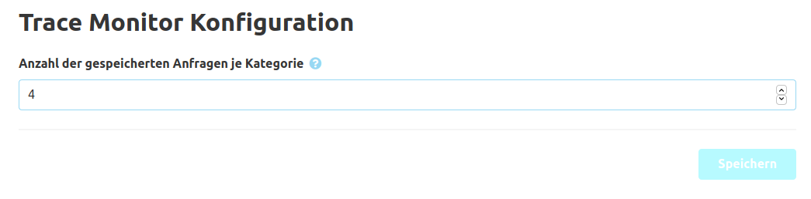

Für den `Trace Monitor` (Übersichtstabelle) kann in der Konfiguration definiert werden wie viele Anfragen je Kategorie gespeichert werden sollen. 
Die Standardgröße des Speichers ist `100`.

Achtung: Eine große Speichergröße kann zu hoher Speicherauslastung führen.

