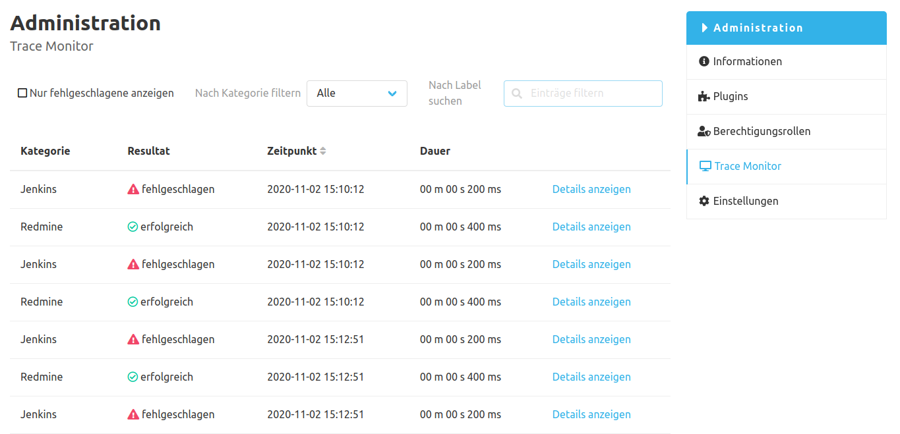
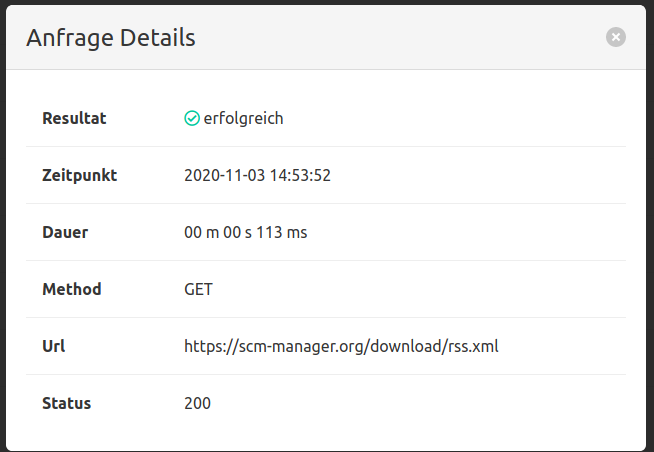

Das Trace-Monitor-Plugin erstellt einen Eintrag in der Navigation in der Administrations-Oberfläche der SCM-Manager Instanz. 
Dahinter befindet sich der `Trace Monitor`. Diese Übersichtstabelle zeigt alle letzten Anfragen des SCM-Managers an. 
Diese Tabelle lässt sich über diverse Filter einschränken und kann nach den Spalten sortiert werden.

Beim Klicken auf `Details anzeigen` wird ein Modal-Dialog mit weiteren Informationen zur Anfrage geöffnet.

