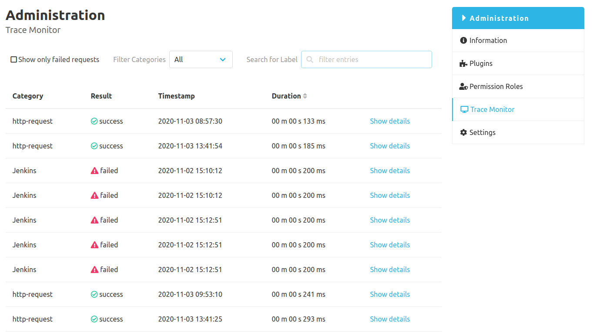
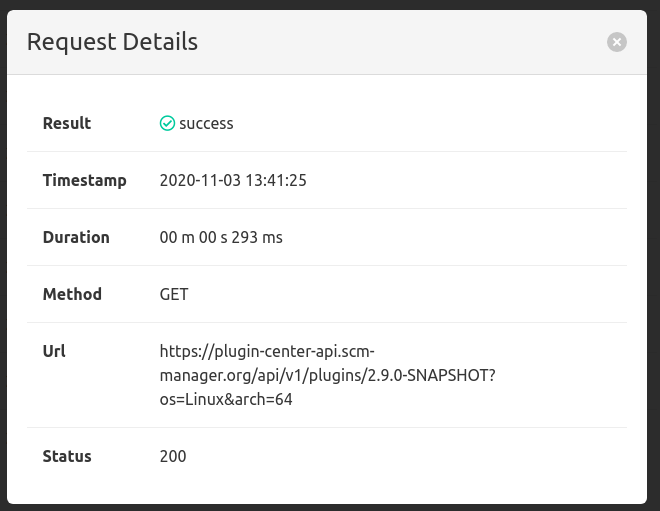

After the installation of the script plugin there is a "Scripts" entry in the navigation menu of the administration area of SCM-Manager.
The Trace Monitor page shows a table of the recent requests. This table is sortable and filterable.

By clicking on `Show details` a modal is shown with further information regarding the request. 

